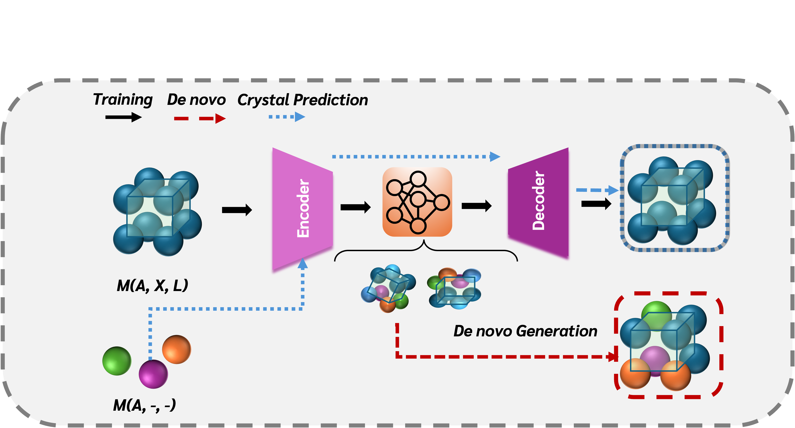

# Crystal Diffusion Variational AutoEncoder

<p align="center">
   
</p>


This is unofficial implementation of the paper: [[Paper]](https://arxiv.org/abs/2110.06197) with minor changes. You may find the original implementation [here](https://github.com/txie-93/cdvae).

## Installation (GPU)
In case you are using old PyTorch versions (1.X.X), follow the official setups. For new versions after settuping [conda](https://conda.io/docs/index.html):
```bash
cd cdvae-main
conda env create -f env.yml
```
### Setting up environment variables

Make a copy of the `.env.template` file and rename it to `.env`. Modify the following environment variables in `.env`.

- `PROJECT_ROOT`: path to the folder that contains this repo
- `HYDRA_JOBS`: path to a folder to store hydra outputs
- `WABDB`: path to a folder to store wabdb outputs

## Training
```
python cdvae/run.py data=perov expname=perov
```

## De novo Generation
```
python scripts/evaluate.py --model_path MODEL_PATH --tasks gen
```

## Conditional Crystal Prediction

```
python scripts/evaluate.py --model_path MODEL_PATH --tasks recon_conditional
```

## Evaluation
Having the checkpoint setup, 

```
python scripts/compute_metrics.py --root_path MODEL_PATH --tasks recon_conditional gen
```
## Citation
Please cite the original paper if found something useful.
```
@article{xie2021crystal,
  title={Crystal Diffusion Variational Autoencoder for Periodic Material Generation},
  author={Xie, Tian and Fu, Xiang and Ganea, Octavian-Eugen and Barzilay, Regina and Jaakkola, Tommi},
  journal={arXiv preprint arXiv:2110.06197},
  year={2021}
}
```
